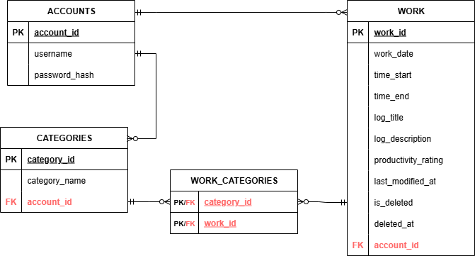
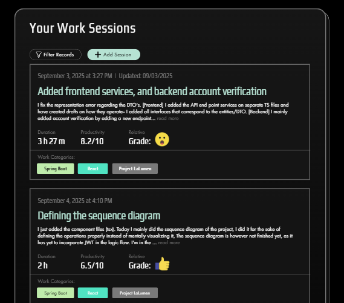
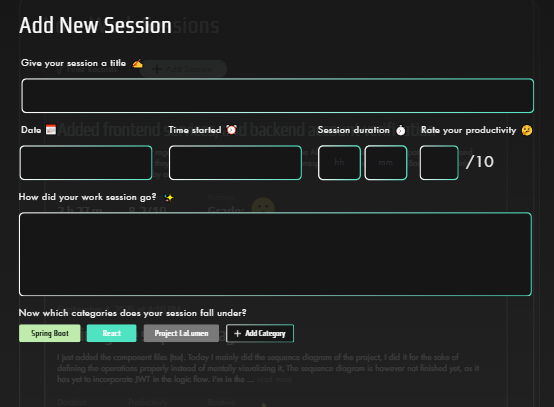
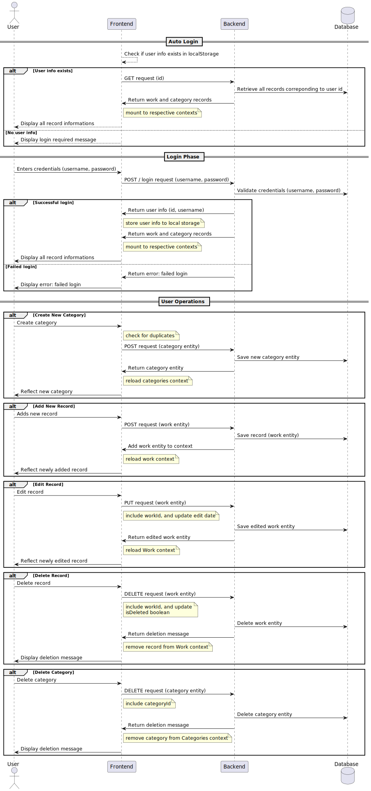

## Short Overview (temporary):

A simple software that allows the user to add logs of their study; how long a study lasted, when the study occurred (time and date), categorize the study by academics/non-acads, write logs with title and descriptions describing the overall session (like a commit), and show analytics of all study records submitted. The overall product should be able to display study/work patterns, and help recognize those patterns to avoid/improve overall. 

Currently the project uses **Java 21 | Spring Boot 3.5.5** and **React 19.1.1**

---
### Entity-Relationship Diagram (v2)

---
### Wireframe Draft
**1. Records Tab**

**2. Add New Record Pop Up**

### Draft Sequence Diagram: Operations

